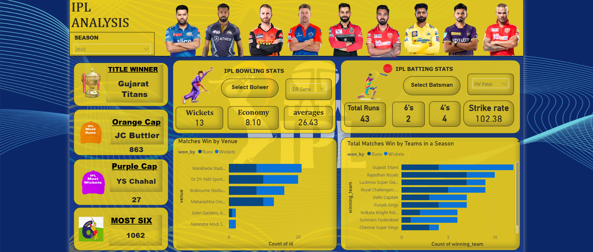

# 🏏 IPL Dashboard Analysis (2008–2022)

## 📌 Project Overview
The **IPL Dashboard Analysis** project is a comprehensive **data analytics and visualization solution** that analyzes Indian Premier League (IPL) data from **2008 to 2022**.  
The goal of this project is to extract **meaningful insights from historical IPL data** related to team performance, player achievements, match results, and venue trends.

This dashboard is built as a **portfolio project** to demonstrate practical skills in **SQL, data cleaning, data modeling, and interactive dashboard design**.

---

## 📂 Dataset Description
- Source: IPL historical match & ball-by-ball datasets (CSV format)
- Time Period: **2008 – 2022**
- Key Tables:
  - Matches data
  - Ball-by-ball data
  - Players data
  - Teams & venues data

The data was **cleaned, transformed, and optimized** using SQL before visualization.

---

## 📊 Dashboard Features

### 🔹 Season Overview
- Season selector to analyze a specific IPL year
- Title Winner of the selected season
- Total matches played and results summary

### 🔹 Player Achievements
- **Orange Cap**: Highest run scorer of the season
- **Purple Cap**: Highest wicket taker of the season
- Most Sixes in a season

### 🔹 Batting Analysis
- Total Runs scored by selected batsman
- Number of 4s and 6s
- Strike Rate comparison across seasons

### 🔹 Bowling Analysis
- Total wickets taken
- Bowling economy rate
- Bowling average

### 🔹 Team Performance
- Matches won by each team in a season
- Win type analysis (by Runs vs by Wickets)
- Team-wise comparison across venues

### 🔹 Venue Analysis
- Matches won at different venues
- Home vs away performance trends

---

## 🛠️ Tools & Technologies Used
- **PostgreSQL** – Data storage, joins, aggregations, window functions
- **SQL** – Data cleaning, transformation, and advanced analysis
- **CSV Dataset** – Raw IPL data source
- **Dashboard Tool** – Interactive data visualization

---

## 🔍 Key Insights
- Identified **top-performing teams and players** across multiple seasons
- Analyzed how **venues influence match outcomes**
- Compared batting and bowling performances season-wise
- Observed long-term trends in IPL team dominance

---

## 🎯 Use Cases
- Sports analytics & performance evaluation
- SQL & data analytics portfolio project
- Business-style reporting and dashboards
- Trend analysis across multiple seasons

---

## 🚀 Future Enhancements
- Add predictive analysis for match outcomes
- Include player form & head-to-head analysis
- Integrate Python for advanced analytics
- Deploy dashboard publicly

---

## 👤 Author
**Aniket Yewale**  
B.Tech IT | Data Analytics Enthusiast
# powerbi-project-1-ipl-dashboard-
